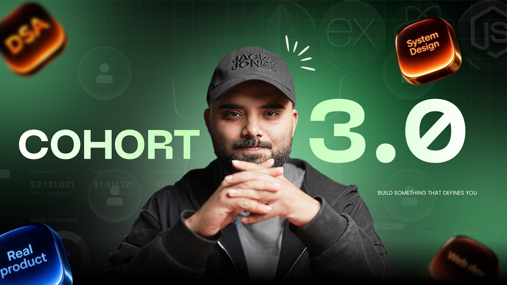

  

<h1 align="center">Sheryians Cohort 3.0</h1>

---

## Introduction

This repository documents my journey in **Sheryians Cohort 3.0**.

The goal of this cohort is to improve problem solving, development skills, consistency, and real-world project building through structured learning and hands-on implementation.

This repository will contain:
- Assignments
- Practice work
- UI builds
- Notes
- Mini projects
- Backend learning
- Learnings and progress updates

---

## Goals

- Build strong frontend and backend fundamentals
- Improve consistency and development workflow
- Learn by building projects
- Practice clean code and GitHub management
- Document the learning journey publicly

---

 Maintained by <strong>Harsh Guleria</strong> 
 
 Learning. Building. Shipping 🚀 

