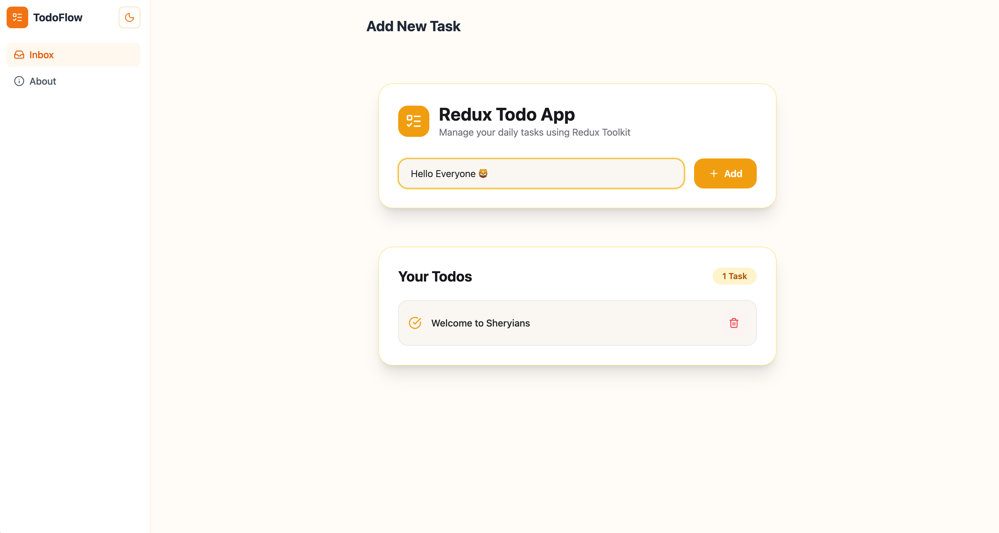

# Redux Toolkit Todo App (Mini Hackathon)

A modern Todo Application built with **React**, **Redux Toolkit**, **React Router**, and **Tailwind CSS**. This project was created as part of the **Redux Toolkit Mini Hackathon** to learn state management by building a real-world application.

---

## Documentation

**Redux Toolkit Notes (Notion)**

Learn the complete concepts of Redux Toolkit explained in simple words.

> https://coffee-wall-687.notion.site/Redux-Toolkit-Notes-3a8f9761854f803bad39ea1654060c24

---

## Explanation Video

I first built a **Counter App** to understand the complete Redux Toolkit data flow and recorded an explanation video. After that, I applied the same concepts by building this Todo App.

**Video Link:**
> https://www.linkedin.com/feed/update/urn:li:activity:7487397484839751680/

---

## Live Demo

**Vercel Deployment**

> https://redux-todo-app-seven-ruddy.vercel.app/

---

## Project Preview

### Todo Management

---

# Features

- Add Tasks
- Delete Tasks
- Display Tasks
- Light & Dark Mode
- Centralized State Management with Redux Toolkit
- Client-Side Routing using React Router
- Persistent Theme Preference
- Clean & Responsive UI

---

# Tech Stack

- React
- Redux Toolkit
- React Redux
- React Router
- Tailwind CSS
- Lucide React
- Vite

---

# What I Learned

During this project, I explored:

- Redux vs Redux Toolkit
- Store
- Slice
- Reducers
- Actions
- configureStore()
- createSlice()
- useDispatch()
- useSelector()
- Redux Data Flow
- State Management
- React Router Integration

---

# Author

**Harsh Guleria**

GitHub: https://github.com/forgewithharsh/sheriyans-cohort3.0

LinkedIn: https://www.linkedin.com/feed/update/urn:li:activity:7487397484839751680/

---

## Acknowledgements

This project was built as part of the **Redux Toolkit Mini Hackathon**.

A sincere thank you to the mentors for designing a challenge that encouraged independent learning through documentation, hands-on practice, project development, and knowledge sharing.
